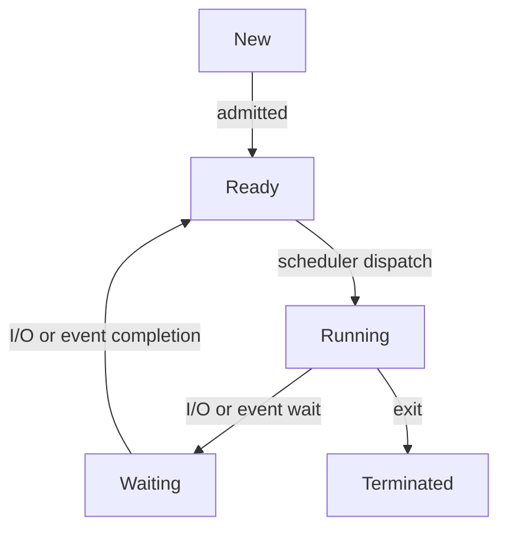

### Description
---
The current state of a process.
### States
---
- [[new]]
- [[ready]]
- [[running]]
- [[waiting]] 
- [[terminated]]

###  Diagram
---

### Key Features
---
- Managed by [[Schedulers]]